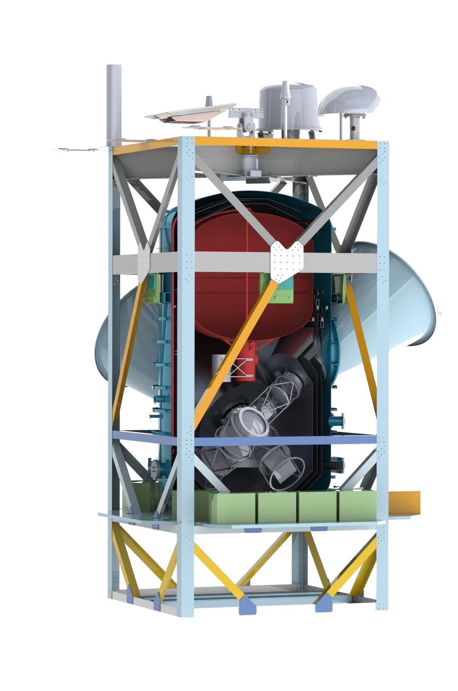

A model of the Taurus payload. A rigid truss structure provides support for the cryostat, electronics, and SPB launch provider components, which include the Support Instrumentation Package (SIP), the SIP solar arrays, and antenna boom. The payload sunshielding and thermal treatments are not drawn in order to more clearly show the main sub-systems.

